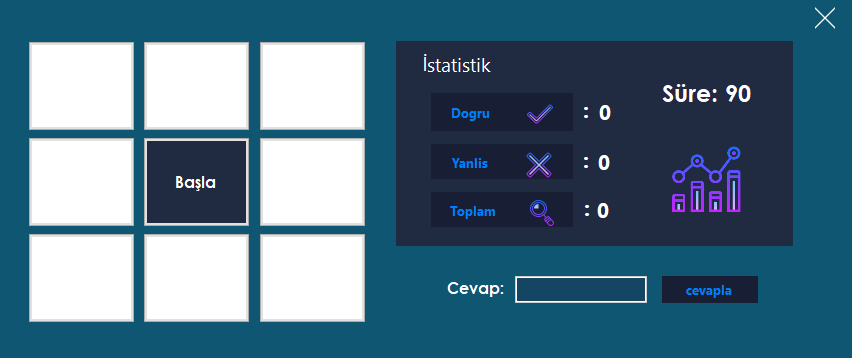
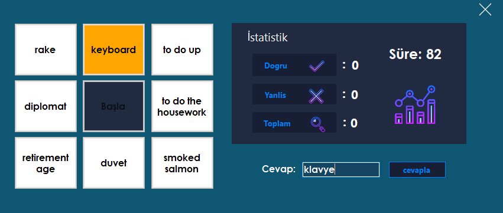
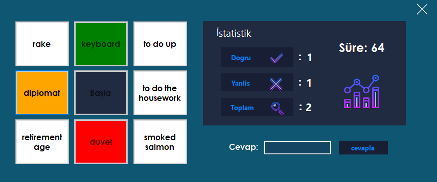

# kelime-ogrenme-uygulamasi
(C# - ACCESS)

### İngilizce - Türkçe kelime öğrenirken öğrenmeyi zevkli hale getiren uygulama.

</img>
 

</img>
 

</img>

## Kurulum

### Kurulum için setup içinden doğrudan kurulum yapabilirsiniz. ardından verilen access veritabanını uygulamanın dosya konumuna atınız.

## kullanım
### Başla butonuna bastıktan sonra, cevap vermek istediğiniz kelimeyi seçin ardından textbox'ın içine cevabı yazınız. cevap doğru ise doğru puanınınz 1 artacaktır 
cevabınız yanlış ise yanlış sayınız 1 artacaktır.
